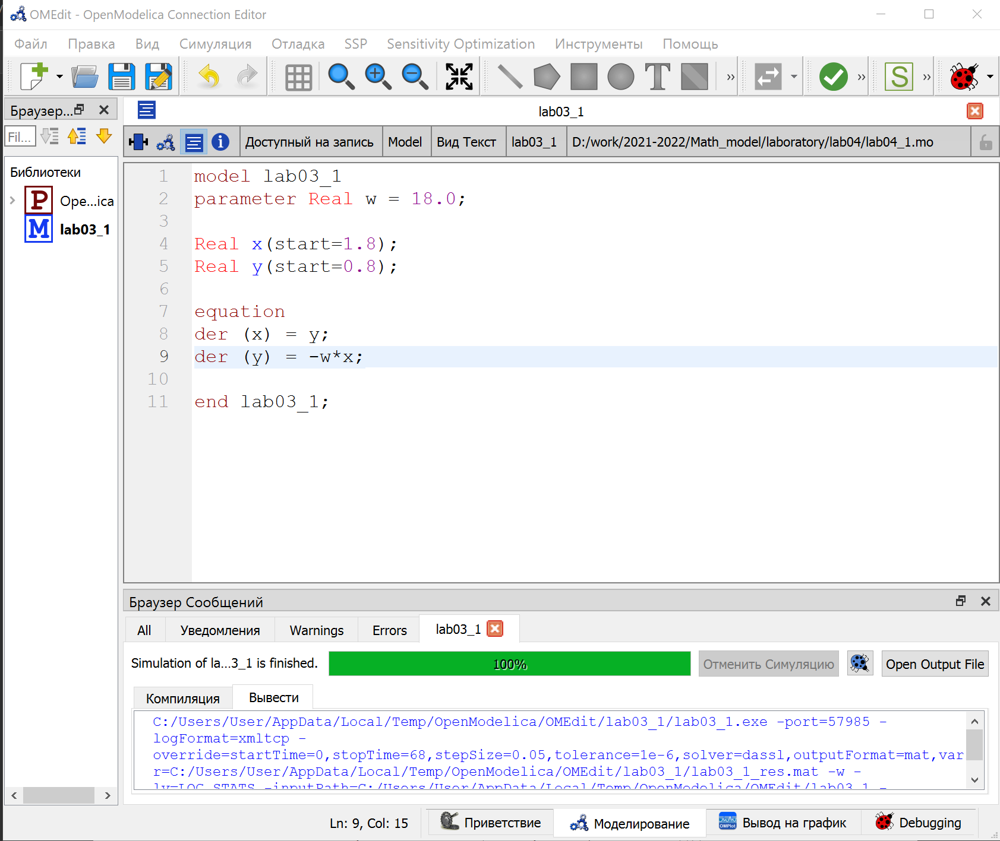
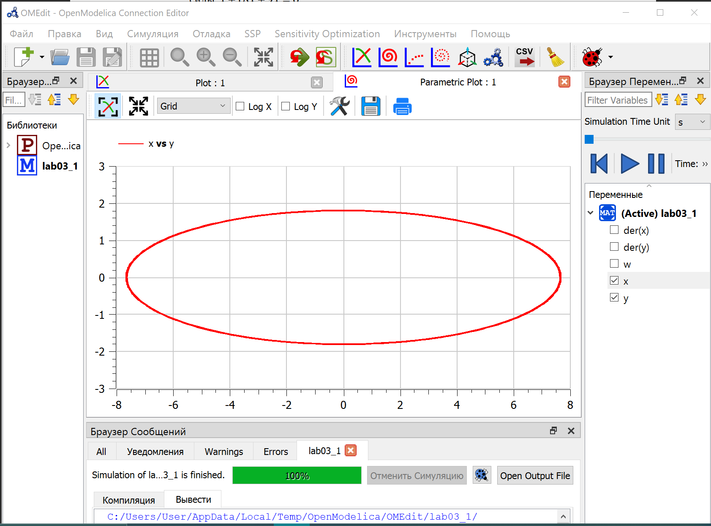
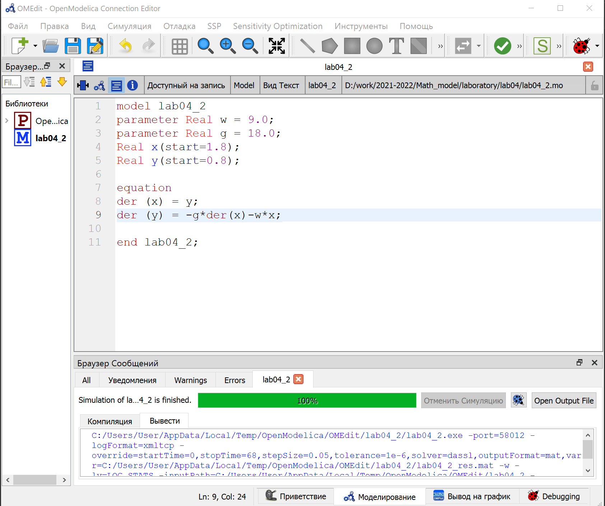
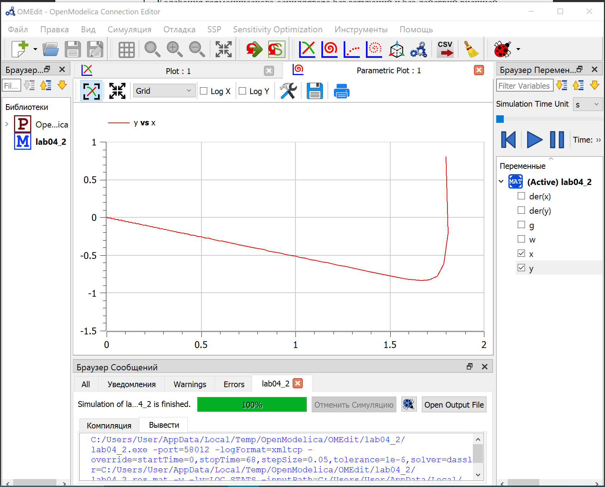
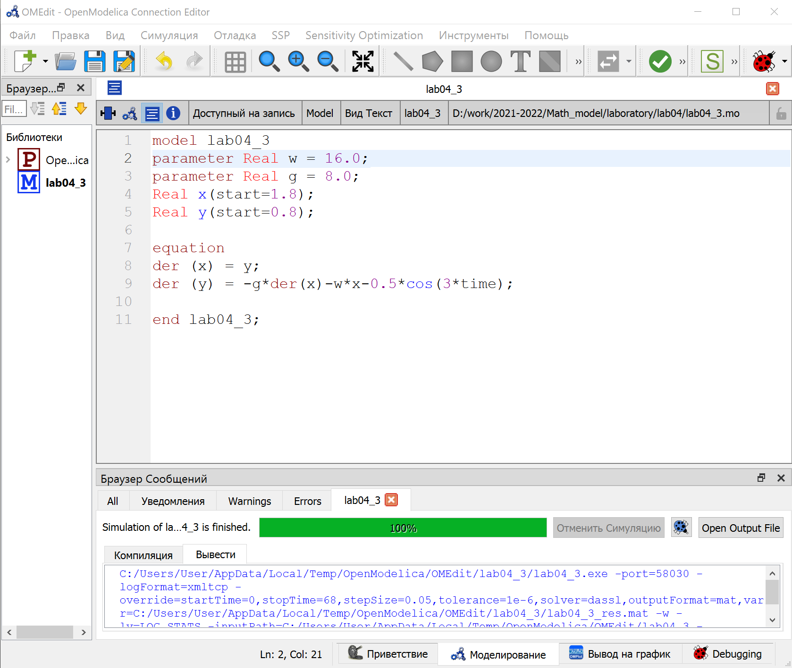
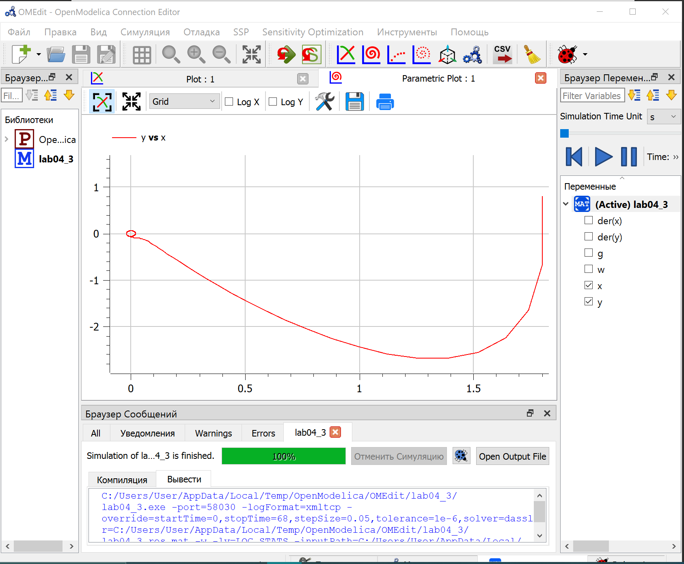

# Цель работы

Построить фазовый портрет гармонического осциллятора и решение уравнения гармонического осциллятора для следующих случаев:

- Колебания гармонического осциллятора без затуханий и без действий внешней силы;

- Колебания гармонического осциллятора c затуханием и без действий внешней силы;

- Колебания гармонического осциллятора c затуханием и под действием внешней силы.

# Задание работы

### Вариант 37

1. 

$$\frac{d^{2}x}{dt^{2}}  + 18x = 0$$

2. 

$$\frac{d^{2}x}{dt^{2}}  + 18 \frac{dx}{dt} + 9x = 0$$

3. 

$$\frac{d^{2}x}{dt^{2}}  + 8 \frac{dx}{dt} + 16x = 0.5cos(3t)$$

На интервале $t ∈ [0; 68]$ шаг (0.05) с начальными условиями $x_{0} = 1.8, y_{0} = 0.8$

# Теоретическое введение

**Гармонические колебания**
— колебания, при которых физическая величина изменяется с течением времени по гармоническому (синусоидальному, косинусоидальному) закону.[1]

**Осциллятор**
— система, совершающая колебания, то есть показатели которой периодически повторяются во времени.[2]

# Выполнение лабораторной работы

## Постановка задачи

Движение грузика на пружинке, маятника, заряда в электрическом контуре, а также эволюция во времени многих систем в физике, химии, биологии и других науках при определенных предположениях можно описать одним и тем же дифференциальным уравнением, которое в теории колебаний выступает в качестве основной модели. Эта модель называется линейным гармоническим осциллятором.

Уравнение свободных колебаний гармонического осциллятора имеет следующий вид:

$$\frac{d^{2}x}{dt^{2}}  + 2\gamma \frac{dx}{dt} + \omega_{0}^{2}x = 0$$

где x – переменная, описывающая состояние системы (смещение грузика, заряд конденсатора и т.д.), $\gamma$ – параметр, характеризующий потери энергии (трение в механической системе, сопротивление в контуре), $\omega_{0}$ – собственная частота колебаний, t – время.

Уравнение - есть линейное однородное дифференциальное уравнение второго порядка и оно является примером линейной динамической системы. При отсутствии потерь в системе ($\gamma = 0$) вместо этого уравнения получаем уравнение консервативного осциллятора энергия колебания которого сохраняется во времени.

$$\frac{d^{2}x}{dt^{2}}  + \omega_{0}^{2}x = 0$$

Для однозначной разрешимости уравнения второго порядка необходимо задать два начальных условия вида:

$$
\begin{cases}
x(t_{0}) = x_{0} \\
\frac{dx}{dt}(t_{0}) = y_{0}
\end{cases}
$$

Уравнение второго порядка можно представить в виде системы двух уравнений первого порядка:

$$
\begin{cases}
\frac{dx}{dt} = y \\
\frac{dy}{dt} = -\omega_{0}^{2}x
\end{cases}
$$

Начальные условия для системы примут вид:

$$
\begin{cases}
x(t_{0}) = x_{0} \\
y(t_{0}) = y_{0}
\end{cases}
$$

Независимые переменные x, y определяют пространство, в котором «движется» решение. Это фазовое пространство системы, поскольку оно двумерно будем называть его фазовой плоскостью.

Значение фазовых координат x, y в любой момент времени полностью определяет состояние системы. Решению уравнения движения как функции времени отвечает гладкая кривая в фазовой плоскости. Она называется фазовой траекторией. Если множество различных решений (соответствующих различным начальным условиям)изобразить на одной фазовой плоскости, возникает общая картина поведения системы. Такую картину, образованную набором фазовых траекторий, называют фазовым портретом.

## Код в OpenModelica

Задаем параметры и прописываем функцию, записываем дифференциальные уравнения.(@fig:001)(@fig:002)(@fig:003)

{#fig:001 width=100%}

Получаем фазовый портрет гармонического осциллятора без затуханий и без действий внешней силы. (@fig:004)

{#fig:004 width=100%}

Теперь для второго случая:

{#fig:002 width=100%}

Получаем фазовый портрет гармонического осциллятора c затуханием и без действий внешней силы. (@fig:005)

{#fig:005 width=100%}

Теперь для третьего случая:

{#fig:003 width=100%}

Получаем фазовый портрет гармонического осциллятора c затуханием и под действием внешней силы. (@fig:006)

{#fig:006 width=100%}

# Вывод

Построили фазовый портрет гармонического осциллятора и решение уравнения гармонического осциллятора для следующих случаев:

- Колебания гармонического осциллятора без затуханий и без действий внешней силы;

- Колебания гармонического осциллятора c затуханием и без действий внешней силы;

- Колебания гармонического осциллятора c затуханием и под действием внешней силы.

# Список литературы

1. Wikipedia: Гармонические колебания ( [1]: [https://ru.wikipedia.org/wiki/%D0%97%D0%B0%D0%BA%D0%BE%D0%BD%D1%8B_%D0%9E%D1%81%D0%B8%D0%BF%D0%BE%D0%B2%D0%B0_%E2%80%94_%D0%9B%D0%B0%D0%BD%D1%87%D0%B5%D1%81%D1%82%D0%B5%D1%80%D0%B0] )
2. Wikipedia: Осциллятор ( [2]: [https://ru.wikipedia.org/wiki/%D0%97%D0%B0%D0%BA%D0%BE%D0%BD%D1%8B_%D0%9E%D1%81%D0%B8%D0%BF%D0%BE%D0%B2%D0%B0_%E2%80%94_%D0%9B%D0%B0%D0%BD%D1%87%D0%B5%D1%81%D1%82%D0%B5%D1%80%D0%B0] )
3. Теоретические материалы курса.